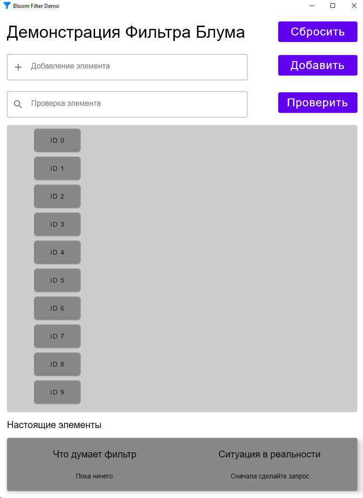
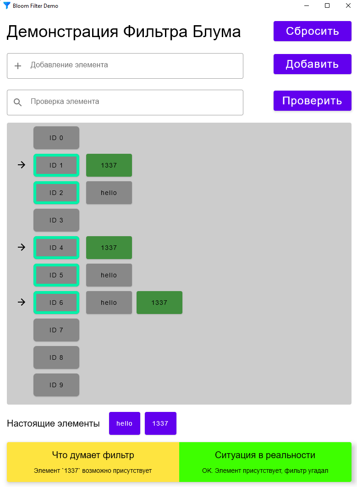

# Bloom Filter Demonstration
## Built in Kotlin, Desktop Compose by kepper104
### A visual representation of how a [Bloom Filter](https://en.wikipedia.org/wiki/Bloom_filter) works

|       App on startup        |  App with some values   |
|:---------------------------:|:-----------------------:|
|  |  |

### Features:
- Add new elements to the filter
- Query (check) if element is in the table, get output both from the bloom filter (down left) and from the analyzer, 
telling if the filter worked correctly or an error (hash collision or similar) occurred
- Currently, uses 3 hash functions, however more can be added easily
- Reset all app data without restarting

### TODO:
- Add English/Russian in-app support
- Update Readme: put english picture in english section and write russian section
- Add option to change table size from the app
- Currently, window barely fits in a normal 1080p monitor in height, need to reduce default table size or table view height